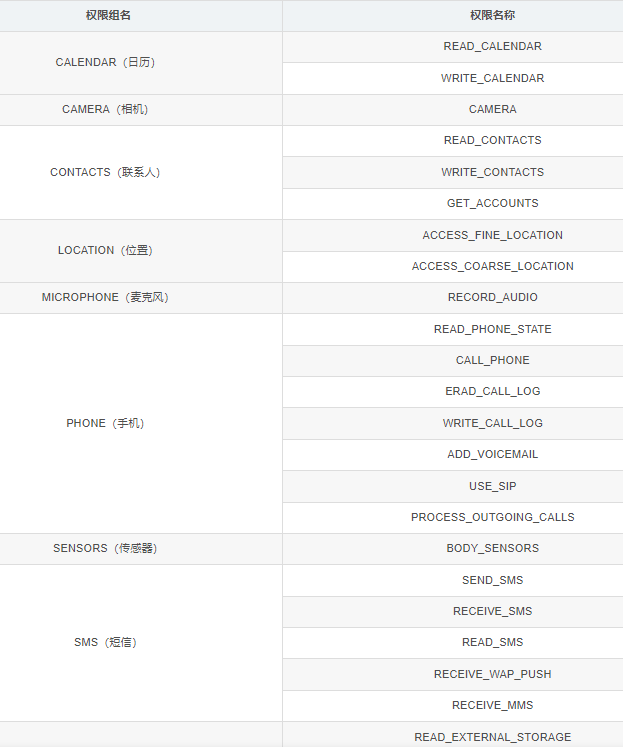

# <center>跨程序共享数据——探究内容提供器</center>
## 1 内容提供器简介
>内容提供器（Content Provider）主要用于在不同的应用程序之间实现数据共享的功能，它提供了一套完整的机制，允许一个程序访问另一个程序中的数据，同时还能保证被访数据的安全性。目前，使用内容提供器是Android实现跨程序共享数据的标准方式。
不同于文件存储和SharedPreferences存储中的两种全局可读写操作模式，内容提供器可以选择只对哪一部分数据进行共享，从而保证我们程序中的隐私数据不会有泄漏的风险。
## 2 运行时权限
Android现在将所有的权限归成了两类，一类是普通权限，一类是危险权限。准确地讲，其实还有第三类特殊权限，不过这种权限使用得很少。
- 普通权限
  指那些不会威胁到用户安全和隐私的权限，这部分权限系统会自动帮我们进行授权不需要手动操作。危险权限则表示那些可能会触及到用户安全隐私或者对设备安全造成影响的权限，如获取手机联系人信息等权限，申请者部分权限必须有用户收到点击授权才可以，否则程序无法使用相应的功能。

- 危险权限
  下面列出 Android 中所有的危险权限，一共是9组24个权限。



运行时权限的核心就是在程序运行过程中由用户授权我们去执行某些危险操作，程序是不可以擅自做主去执行这些危险操作的。

因此，第一步就是要先判断用户是不是已经给过我们授权了，借助的是ContextCompat.checkSelfPermission()方法。
checkSelfPermission()方法接收两个参数:
第一个参数是Context;
第二个参数是具体的权限名，比如打电话的权限名就是Manifest.permission.CALL_PHONE，然后我们使用方法的返回值和PackageManager. PERMISSION_GRANTED做比较，相等就说明用户已经授权，不等就表示用户没有授权。

如果已经授权的话就简单了，直接去执行拨打电话的逻辑操作就可以了，这里我们把拨打电话的逻辑封装到了call()方法当中。
如果没有授权的话，则需要调用ActivityCompat. requestPermissions()方法来向用户申请授权，
requestPermissions()方法接收3个参数:
第一个参数要求是Activity的实例;
第二个参数是一个String数组，我们把要申请的权限名放在数组中即可;
第三个参数是请求码，只要是唯一值就可以了，这里传入了1。
调用完了requestPermissions()方法之后，系统会弹出一个权限申请的对话框，然后用户可以选择同意或拒绝我们的权限申请，不论是哪种结果，最终都会回调到onRequest-PermissionsResult()方法中，而授权的结果则会封装在grantResults参数当中。这里我们只需要判断一下最后的授权结果，如果用户同意的话就调用call()方法来拨打电话，如果用户拒绝的话我们只能放弃操作，并且弹出一条失败提示。
</br>

## 3 访问其他程序中的数据
内容提供器的用法一般有两种:
一种是使用现有的内容提供器来读取和操作相应程序中的数据;
另一种是创建自己的内容提供器给我们程序的数据提供外部访问接口。

如果一个应用程序通过内容提供器对其数据提供了外部访问接口，那么任何其他的应用程序就都可以对这部分数据进行访问。Android系统中自带的电话簿、短信、媒体库等程序都提供了类似的访问接口，这就使得第三方应用程序可以充分地利用这部分数据来实现更好的功能。
### 3.1 ContentResolver的基本用法
对于每一个应用程序来说，如果想要访问内容提供器中共享的数据，就一定要借助Content-Resolver类，可以通过Context中的getContentResolver()方法获取到该类的实例。
Content-Resolver中提供了一系列的方法用于对数据进行CRUD操作，其中insert()方法用于添加数据，update()方法用于更新数据，delete()方法用于删除数据，query()方法用于查询数据。
不同于SQLiteDatabase, ContentResolver中的增删改查方法都是不接收表名参数的，而是使用一个Uri参数代替，这个参数被称为内容URI。
内容URI给内容提供器中的数据建立了唯一标识符，它主要由两部分组成：authority和path。
- authority是用于对不同的应用程序做区分的，一般为了避免冲突，都会采用程序包名的方式来进行命名。比如某个程序的包名是com.example. app，那么该程序对应的authority就可以命名为com.example.app. provider。
- path则是用于对同一应用程序中不同的表做区分的，通常都会添加到authority的后面。比如某个程序的数据库里存在两张表：table1和table2，这时就可以将path分别命名为/table1和/table2，然后把authority和path进行组合，内容URI就变成了com.example.app.provider/table1和com.example.app.provider/table2。不过，

目前还很难辨认出这两个字符串就是两个内容URI，我们还需要在字符串的头部加上协议声明。因此，内容URI最标准的格式写法如下：
```
        content://com.example.app.provider/table1
        content://com.example.app.provider/table2
```
内容URI可以非常清楚地表达出我们想要访问哪个程序中哪张表里的数据。也正是因此，ContentResolver中的增删改查方法才都接收Uri对象作为参数，因为如果使用表名的话，系统将无法得知我们期望访问的是哪个应用程序里的表。

在得到了内容URI字符串之后，我们还需要将它解析成Uri对象才可以作为参数传入。解析的方法也相当简单，代码如下所示：
```
        Uri uri = Uri.parse("content://com.example.app.provider/table1")
```
只需要调用Uri.parse()方法，就可以将内容URI字符串解析成Uri对象了。

- 使用这个Uri对象来查询table1表中的数据:
```
        Cursor cursor = getContentResolver().query(            
          uri,            
          projection,            
          selection,            
          selectionArgs,            
          sortOrder);
```
.query()方法参数.png)


查询完成后返回的仍然是一个Cursor对象，这时我们就可以将数据从Cursor对象中逐个读取出来了。读取的思路仍然是通过移动游标的位置来遍历Cursor的所有行，然后再取出每一行中相应列的数据，代码如下所示：

```
        if (cursor ! = null) {            
          while (cursor.moveToNext()) {                
            String column1 = cursor.getString(cursor.getColumnIndex("column1"));                
            int column2 = cursor.getInt(cursor.getColumnIndex("column2"));            
            }            
            cursor.close();       
            }
```

- 向table1表中添加一条数据，代码如下所示：
  ```
          ContentValues values = new ContentValues();        
          values.put("column1", "text");        
          values.put("column2", 1);        
          getContentResolver().insert(uri, values);
  ```
  可以看到，仍然是将待添加的数据组装到ContentValues中，然后调用ContentResolver的insert()方法，将Uri和ContentValues作为参数传入即可。现在如果我们想要更新这条新添加的数据，把column1的值清空，可以借助ContentResolver的update()方法实现，代码如下所示：
  ```
          ContentValues values = new ContentValues();        
          values.put("column1", "");        
          getContentResolver().update(uri, values, "column1 = ? and column2 = ? ", new String[] {"text", "1"});
  ```

  调用ContentResolver的delete()方法将这条数据删除掉，代码如下所示：
  ```
          getContentResolver().delete(uri, "column2 = ? ", new String[] { "1" });
  ```

## 4 创建自己的内容提供器
### 4.1 创建内容提供器的步骤
如果想要实现跨程序共享数据的功能，官方推荐的方式就是使用内容提供器，可以通过新建一个类去继承ContentProvider的方式来创建一个自己的内容提供器。
ContentProvider类中有6个抽象方法，我们在使用子类继承它的时候，需要将这6个方法全部重写。
新建MyProvider继承自ContentProvider，代码如下所示：
```
        public class MyProvider extends ContentProvider {            
          @Override            
          public boolean onCreate() {                
            return false;            
            }            
            @Override            
            public Cursor query(Uri uri, String[] projection, String selection, String[]                
            selectionArgs, String sortOrder) {                
              return null;            
              }            
              @Override            
              public Uri insert(Uri uri, ContentValues values) {                
                return null;            
                }            
                @Override            
                public int update(Uri uri, ContentValues values, String selection, String[]                
                selectionArgs) {                
                  return 0;            
                  }            
                  @Override            
                  public int delete(Uri uri, String selection, String[] selectionArgs) {                
                    return 0;            }            
                    @Override            
                    public String getType(Uri uri) {                
                      return null;            
                      }        
                      }
```
- 1．onCreate()初始化内容提供器的时候调用。
  通常会在这里完成对数据库的创建和升级等操作，返回true表示内容提供器初始化成功，返回false则表示失败。
- 2．query()从内容提供器中查询数据。
  使用uri参数来确定查询哪张表，projection参数用于确定查询哪些列，selection和selectionArgs参数用于约束查询哪些行，sortOrder参数用于对结果进行排序，查询的结果存放在Cursor对象中返回。
- 3．insert()向内容提供器中添加一条数据。
  使用uri参数来确定要添加到的表，待添加的数据保存在values参数中。添加完成后，返回一个用于表示这条新记录的URI。
- 4．update()更新内容提供器中已有的数据。
  使用uri参数来确定更新哪一张表中的数据，新数据保存在values参数中，selection和selectionArgs参数用于约束更新哪些行，受影响的行数将作为返回值返回。
- 5．delete()从内容提供器中删除数据。
  使用uri参数来确定删除哪一张表中的数据，selection和selectionArgs参数用于约束删除哪些行，被删除的行数将作为返回值返回。

一个标准的内容URI写法是这样的：
```
        content://com.example.app.provider/table1
```
这就表示调用方期望访问的是com.example.app这个应用的table1表中的数据。除此之外，我们还可以在这个内容URI的后面加上一个id，如下所示：
```
        content://com.example.app.provider/table1/1
```
这就表示调用方期望访问的是com.example.app这个应用的table1表中id为1的数据。

内容URI的格式主要就只有以上两种，以路径结尾就表示期望访问该表中所有的数据，以id结尾就表示期望访问该表中拥有相应id的数据。
我们可以使用通配符的方式来分别匹配这两种格式的内容URI，规则如下:
❑ *：表示匹配任意长度的任意字符。
❑ #：表示匹配任意长度的数字。

所以，一个能够匹配任意表的内容URI格式就可以写成：
```
        content://com.example.app.provider/*
```

而一个能够匹配table1表中任意一行数据的内容URI格式就可以写成：
```
        content://com.example.app.provider/table1/#
```
接着，我们再借助UriMatcher这个类就可以轻松地实现匹配内容URI的功能。UriMatcher中提供了一个addURI()方法，这个方法接收3个参数，可以分别把authority、path和一个自定义代码传进去。这样，当调用UriMatcher的match()方法时，就可以将一个Uri对象传入，返回值是某个能够匹配这个Uri对象所对应的自定义代码，利用这个代码，我们就可以判断出调用方期望访问的是哪张表中的数据了。


有一个方法你会比较陌生，即getType()方法。
它是所有的内容提供器都必须提供的一个方法，用于获取Uri对象所对应的MIME类型。一个内容URI所对应的MIME字符串主要由3部分组成，Android对这3个部分做了如下格式规定。
❑ 必须以vnd开头。
❑ 如果内容URI以路径结尾，则后接android.cursor.dir/，如果内容URI以id结尾，则后接android.cursor.item/。
❑ 最后接上vnd.<authority>.<path>。

所以，对于content://com.example.app.provider/table1这个内容URI，它所对应的MIME类型就可以写成：
```
        vnd.android.cursor.dir/vnd.com.example.app.provider.table1
```

对于content://com.example.app.provider/table1/1这个内容URI，它所对应的MIME类型就可以写成：
```
        vnd.android.cursor.item/vnd.com.example.app.provider.table1
```