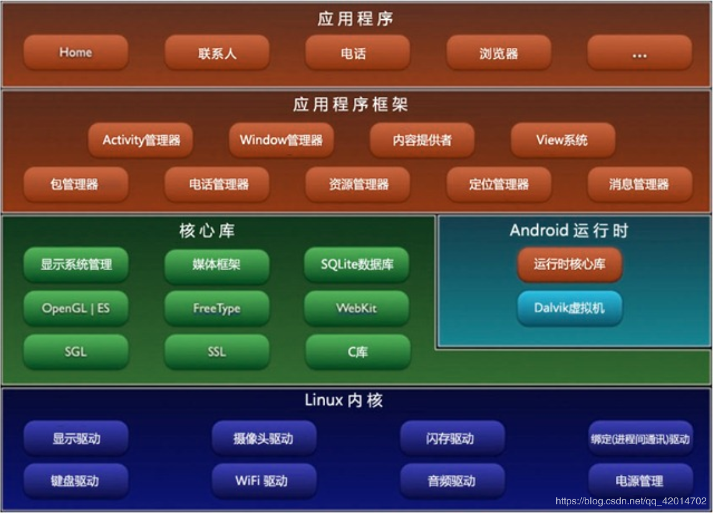

# Android
## 安卓架构

Linux内核层为Andr oid 设备的各种硬件提供了底层的驱动。
系统运行库层通过一些C/C++ 库为Andr oid 系统提供了主要的特性支持。
应用框架层主要提供了构建应用程序时可能用到的各种API。
 应用层：所有安装在手机上的应用程序都是属于这一层的。
## Android应用开发特色
### 1．四大组件
Android系统四大组件分别是活动（Activity）、服务（Service）、广播接收器（Broadcast Receiver）和内容提供器（Content Provider）。其中活动（Activity）是所有Android应用程序的门面，凡是在应用中你看得到的东西，都是放在活动中的。而服务就比较低调了，你无法看到它，但它会一直在后台默默地运行，即使用户退出了应用，服务仍然是可以继续运行的。广播接收器允许你的应用接收来自各处的广播消息，比如电话、短信等，当然你的应用同样也可以向外发出广播消息。内容提供器则为应用程序之间共享数据提供了可能，比如你想要读取系统电话簿中的联系人，就需要通过内容提供器来实现。
### 2．丰富的系统控件
不满足于系统自带的控件效果，也完全可以定制属于自己的控件。
### 3．SQLite数据库
Android系统还自带了这种轻量级、运算速度极快的嵌入式关系型数据库。
### 4．强大的多媒体
Android系统还提供了丰富的多媒体服务，如音乐、视频、录音、拍照、闹铃，等等，这一切你都可以在程序中通过代码进行控制，让你的应用变得更加丰富多彩。
### 5．地理位置定位
移动设备和PC相比起来，地理位置定位功能应该可以算是很大的一个亮点。现在的Android手机都内置有GPS，走到哪儿都可以定位到自己的位置，发挥你的想象就可以做出创意十足的应用，如果再结合功能强大的地图功能，LBS这一领域潜力无限。
# 重点摘要
- Package name表示项目的包名，Android系统就是通过包名来区分不同应用程序的，因此包名一定要具有唯一性。

- 任何一个新建的项目都会默认使用Android模式的项目结构，但这并不是项目真实的目录结构，而是被Android Studio转换过的。点击图中的Android区域可以切换项目结构模式。
<div align=center></div>
<br/>

## ***Project模式的项目结构***

- 1．.gradle和.idea
  - 这两个目录里都是Android Studio**自动**生成的。(不需要操作)
- ***2．app***
  - <font color=red>项目中的代码、资源等几乎都在这里，后面的开发工作也基本在这里</font>
- 3．build
  - 主要是编译时**自动生成**的文件（无需关心）。
- 4．gradle 
  目录下包含了gradle wrapper的配置文件，使用gradle wrapper的方式不需要提前将gradle下载好，而是会**自动**根据本地的缓存情况决定是否需要联网下载gradle。Android Studio默认没有启用gradle wrapper的方式，如果需要打开，可以点击Android Studio导航栏→File→Settings→Build, Execution,Deployment→Gradle，进行配置更改。
  >Gradle是一个开源的自动构建工具，可以作为android studio工程的依赖管理和打包工具，包括三方库和jar包的依赖和链接， java和res等资源的编译和打包
  Wrapper，顾名思义，就是 Gradle 的一层包装，便于在团队开发过程中统一 Gradle 构建的版本。这样大家都可以用统一的 Gradle 版本进行构建工程，可以避免因为 Gradle 版本不统一而带来的问题。
- 5．.gitignore
  - 文件用来将指定的目录或文件排除在版本控制之外
  >版本控制是指对软件开发过程中各种程序代码、配置文件及说明文档等文件变更的管理，是软件配置管理的核心思想之一。
- 6. build.gradle
  - 这是项目全局的gradle构建脚本，**通常不需要修改**
- 7．gradle.properties
  - 这个文件是全局的gradle配置文件，在这里配置的属性将会影响到项目中所有的gradle编译脚本。
- 8．gradlew和gradlew.bat
  - 这两个文件是用来在命令行界面中执行gradle命令的，其中gradlew是在Linux或Mac系统中使用的，gradlew.bat是在Windows系统中使用的。
- 9．HelloWorld.iml
  - ml文件是所有IntelliJ IDEA项目都会自动生成的一个文件（Android Studio是基于IntelliJ IDEA开发的），用于标识这是一个IntelliJ IDEA项目，我们**不需要修改**这个文件中的任何内容。
  >IDEA 全称 IntelliJ IDEA，是java编程语言的集成开发环境。
- 10．local.properties
  - 这个文件用于指定本机中的Android SDK路径，通常内容是自动生成的，我们并**不需要修改**。除非你本机中的Android SDK位置发生了变化，那么就将这个文件中的路径改成新的位置即可。
  >Android SDK 指的是Android专属的软件开发工具包。
- 11．settings.gradle
  - 这个文件用于指定项目中所有引入的模块。由于HelloWorld项目中只有一个app模块，因此该文件中也就只引入了app这一个模块。通常情况下，模块的引入是**自动完成**的，需要我们手动修改这个文件的场景可能比较少。

### ***app目录下的结构***
*1．build*
这个目录和外层的build目录类似，主要也是包含了一些在编译时自动生成的文件，不过它里面的内容会更加更杂，我们**不需要过多关心**。
*2. libs*
自动把目录下的jar包添加到构建路径
*3．androidTest*
此处是用来编写Android Test测试用例的，可以对项目进行一些自动化测试。
***4．java***
<font color=red>存放java代码的地方</font>
*5．res*
就是在项目中使用到的所有图片、布局、字符串等资源都要存放在这个目录下。这个目录下还有很多子目录，图片放在drawable目录下，布局放在layout目录下，字符串放在values目录下
*6．AndroidManifest.xml*
整个Android项目的配置文件，你在程序中定义的所有四大组件都需要在这个文件里注册，另外还可以在这个文件中给应用程序添加权限声明。
*7．test*
编写Unit Test测试用例的，是对项目进行自动化测试的另一种方式。
*8．.gitignore*
用于将app模块内的指定的目录或文件排除在版本控制之外，作用和外层的.gitignore文件类似。
*9．app.iml*
IntelliJ IDEA项目自动生成的文件，我们**不需要关心或修改**这个文件中的内容。
*10．build.gradle*
这是app模块的gradle构建脚本，这个文件中会指定很多项目构建相关的配置
*11．proguard-rules.pro*
这个文件用于指定项目代码的混淆规则，当代码开发完成后打成安装包文件，如果不希望代码被别人破解，通常会将代码进行混淆，从而让破解者难以阅读。

## HelloWorld 项目分析
Android-Manifest.xml文件中代码：
```
<activity android:name=".HelloWorldActivity">
  <intent-filter>
    <action android:name="android.intent.action.MAIN"/>
    <category android:name="android.intent.category.LAUNCHFR" />
  </intent-filter>
</activity>
```
这段代码表示对HelloWorldActivity这个活动进行注册，没有在AndroidManifest.xml里注册的活动是不能使用的。
**intent-filter**里的两行代码非常重要，```<action android:name="android.intent.action.MAIN" />```和```<category android:name="android.intent.category. LAUNCHER" />```表示HelloWorldActivity是这个项目的主活动，在手机上点击应用图标，首先启动的就是这个活动。

*HelloWorldActivity代码*
```
public class HelloWorldAtivity extends AppCompatActivity{
    @Override
    protected void onCreate(Bundle savedInstanceState){
      super.onCreate(savedInstanceState);
      setContentView(R.layout.hello_world_layout);
    }
}
```


# 碰到的问题
## 软件使用
- activity_main.xml：布局文件，Android的UI界面显示的视图，所有的控件在这里设计。为什么点进去没有代码？教程也不写，太烦了。
  [解决方案](https://wenku.baidu.com/view/97dbe7976adc5022aaea998fcc22bcd126ff4219.html)

- Cannot resolve symbol 'XXX'
  [解决方案](https://blog.csdn.net/WuLex/article/details/83414031?spm=1001.2101.3001.6661.1&utm_medium=distribute.pc_relevant_t0.none-task-blog-2%7Edefault%7ECTRLIST%7Edefault-1-83414031-blog-107996641.pc_relevant_multi_platform_whitelistv1_exp2&depth_1-utm_source=distribute.pc_relevant_t0.none-task-blog-2%7Edefault%7ECTRLIST%7Edefault-1-83414031-blog-107996641.pc_relevant_multi_platform_whitelistv1_exp2&utm_relevant_index=1)

- Android Studio点击 DeviceManager不显示设备管理窗口的问题
  [解决方案](https://blog.csdn.net/KimBing/article/details/123049886)