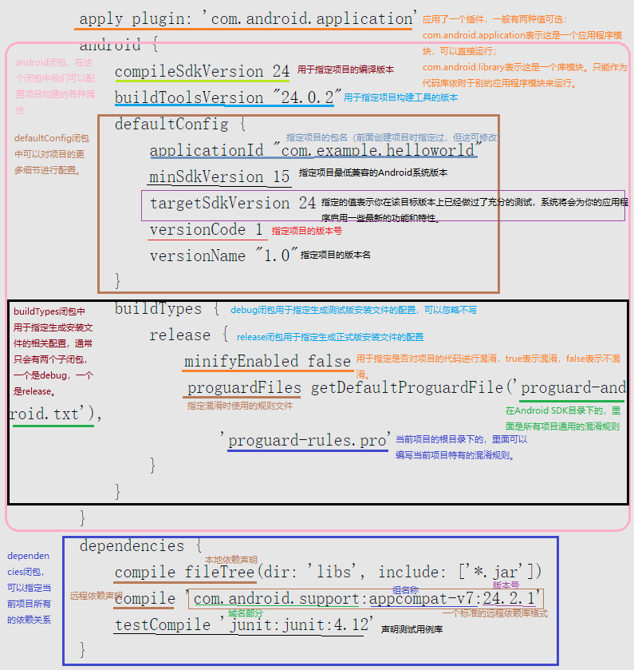

# 
陈垒垒-7.27-日报

&emsp;&emsp;今天主要学习的是Android Studio的内容，与昨日主要是学习Android相关概念性东西不同。今天主要是拿一些简单的程序来练习，不用模板，从头开始手写Activity，并且学习build.gradle等文件中重要代码的含义。目前来说，由于相关知识储备还是太少，一些介绍性的概念还仅仅停留在有那么一个东西的状态，还需要更多的学习来更深入了解。
例如：
