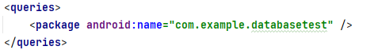

***<h4>
陈垒垒-8.15-日报
</h4>***
&emsp;&emsp;今天主要是回顾了上周所学的知识，并且完成相关笔记，并且弄懂了一些之前忽略的知识点。如：moveToNext不仅仅用来遍历cursor内容，在一开始mPos=-1（cursor初始位置是在-1,而数据是从0开始的），而moveToNext调用的是moveToPosition（mPos+1)，这样刚好一开始从0开始。此外也顺利解决了上周不能跨程序访问数据的问题：在Android 11的更新中，改变了当前应用于本机其他应用进行交互的方式，要在需要访问其他应用的Provider的应用的Manifest中加入<queries>元素，在该元素内声明想要访问的其他应用资源。
